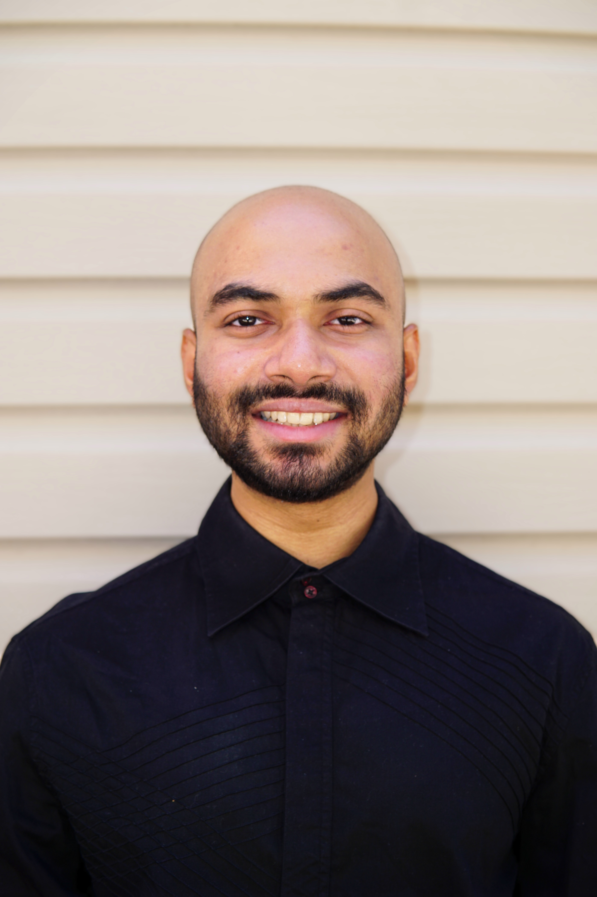

## 😃 About Me

Hi there! I'm **Ahnaf**, an aspiring `Software Engineer` and `Web Developer`. I'm a Computer Science student at Queens College CUNY. My focus is designing and creating functional and responsive websites/web applications. I've done various projects both independently and with teams. I'm proficient in many programming languages such as `Java`, `JavaScript`, and some of its frameworks. I have experience with Front-End Web Development and Relational Databases. I'm interested in building platforms that leverage the power of AI.

## 🌟 Fun Facts

- Besides programming, I love street photography and video editing.
- I also play the guitar, so if you are down for a jamming session, hit me up!

## 📄 Resume

- [Resume](Resources/Ahnaf_Ahmed_Resume_8_24.pdf)

## 📫 Contact Me

- Email: contact.ahnafahmed@gmail.com
- [LinkedIn](https://www.linkedin.com/in/ahnafahmed13)
- [GitHub](https://github.com/AhnafAhmed13)